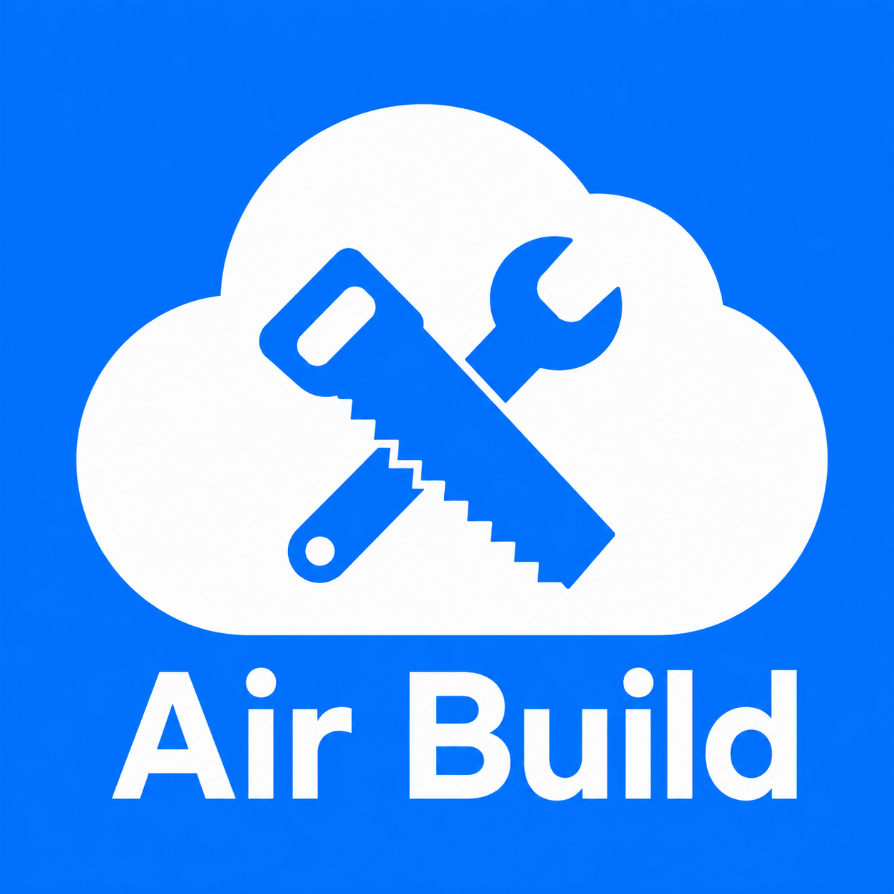
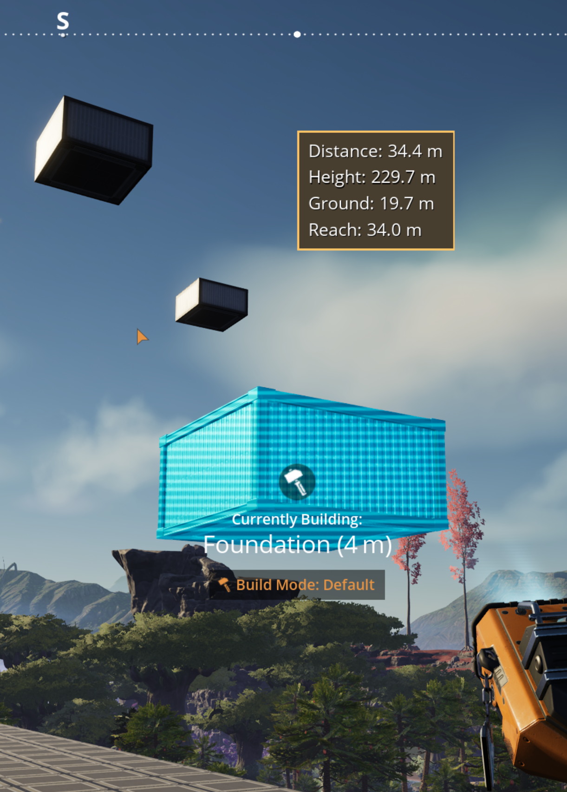

<p align="center"></p>

# Air Build

A small, focused mod for Satisfactory 1.2+. It adds an **air-placement mode** to the build gun: hold a building, toggle the mode on, and the hologram floats in the air at a camera-relative distance along your aim line — instead of spamming the vanilla nudge keys to lift a piece into place.

A **Finalomega Labs** mod. Standalone and self-contained; it does **not** depend on any other mod.

<p align="center"></p>

## What it does

- Toggle air-place mode while holding any supported building.
- The hologram floats along your view at a set **reach** (how far out it sits); push it out or pull it in.
- Vanilla placement rules still apply — clearance, overlap, hard conflicts, and material cost behave exactly as in the base game. (One deliberate exception: the "Surface is too uneven!" floor check is dropped for air-placed factory buildings, mirroring what vanilla already allows for a locked hologram.)
- An on-screen indicator shows **Distance** (from you), **Ground** (height above the surface below), and **Reach**.

## Controls

All rebindable under **Options → Keybindings → "Air Build."**

| Action | Default |
|---|---|
| Toggle air-place mode (sticky) | **`-`** (Minus) |
| Adjust reach — **hold** and roll the mouse wheel | **`=`** (Equals) |
| Rotate hologram (plain wheel) | unchanged (vanilla) |
| Snap to world grid | **Ctrl** (vanilla) |

## Config

In-game **Mod Settings → Air Build**:

- **Air Placement** — Default Reach (15 m), Minimum Reach (2 m), Maximum Reach (200 m), Reach Step (0.5 m per wheel notch).
- **Indicator** — Show Indicator, Position X, Position Y, Scale.

## Notes

- **Resource-node buildings are excluded** (miners, oil/water extractors, frackers, geothermal generators, resource wells). They must snap to a resource node, so air-place doesn't engage for them — they behave 100% vanilla.
- **Multiplayer:** works in single-player and multiplayer, including dedicated servers (verified with a factory building on a Windows dedicated server). Resource buildings are excluded in all cases (by design).
- It places standard Satisfactory buildings at normal cost — nothing here is free.

## Help & bug reports

Report bugs and track issues on [GitHub Issues](https://github.com/majormer/AirBuild/issues). For community chat and support, join the [Discord](https://discord.gg/SgXY4CwXYw).

## Support

If Air Build is useful to you, you can support development on [Ko-fi](https://ko-fi.com/finalomega).

## Building

Standard SML 3.12+ / Satisfactory 1.2 (UE 5.6 CSS) mod plugin. Package with Alpakit, or:

```
RunUAT.bat PackagePlugin -ScriptsForProject=<path>/FactoryGame.uproject -DLCName=AirBuild -build -platform=Win64 -nocompileeditor -installed
```

## License & AI disclosure

Air Build is **source-available** — see [LICENSE.md](LICENSE.md). AI-assisted development was used; see [AI_DISCLOSURE.md](AI_DISCLOSURE.md).
